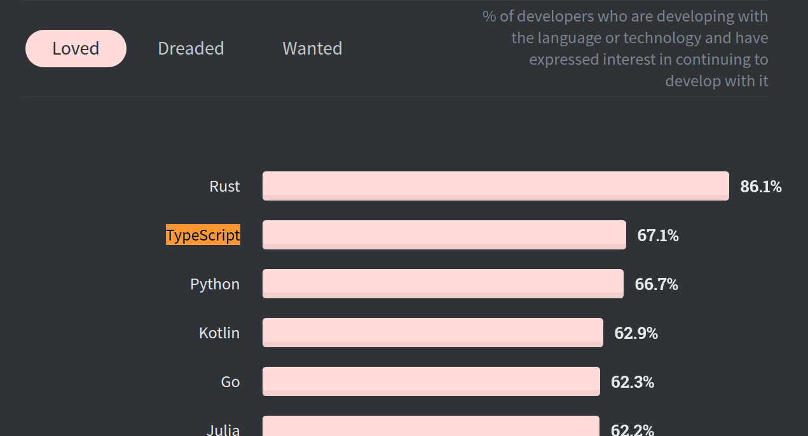
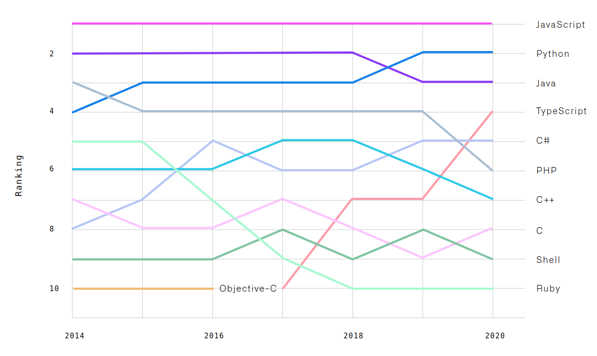
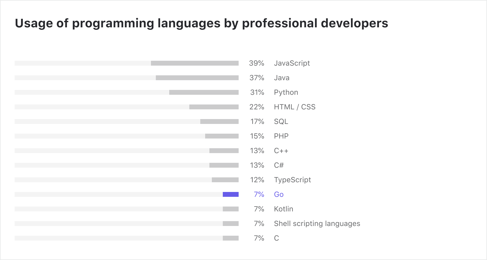
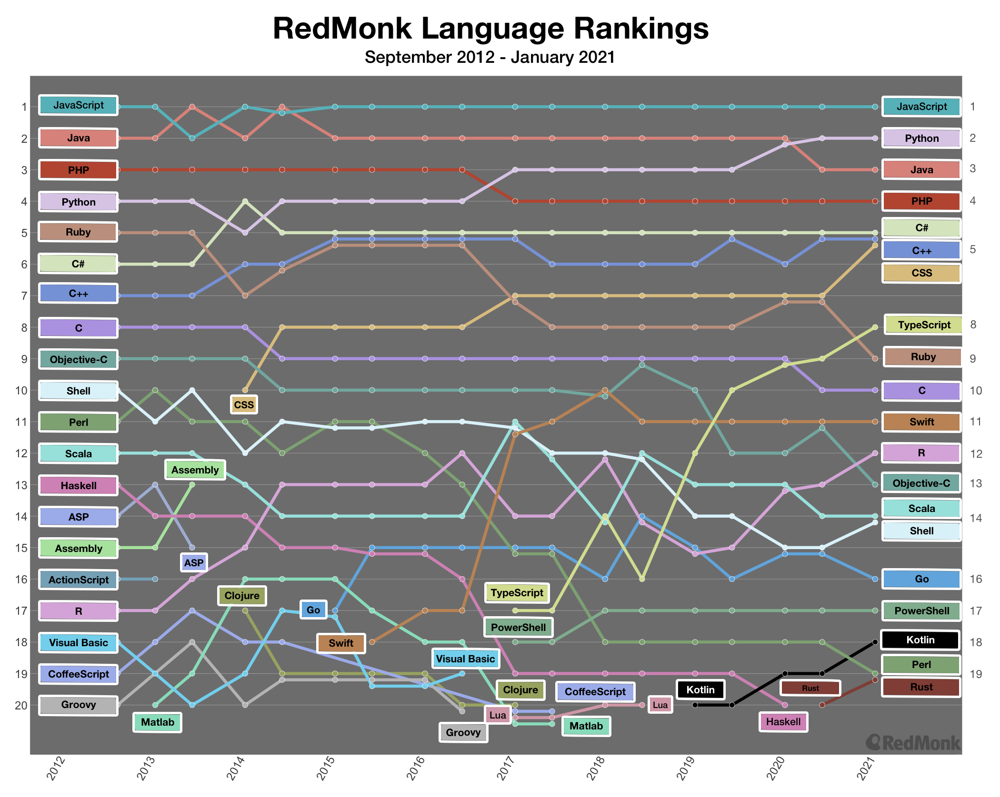

# 现代编程语言及其发展现状

## 什么是现代编程语言

“现代编程语言”该怎么理解？许多人认为Python、JavaScript等语言是现代编程语言，而Java是一种古老的编程语言。实际上，它们都是在同一时间出现的:1995年。

大多数主流编程语言都是在上个世纪发展起来的，主要是在20世纪70年代(如C)、80年代(如c++)、90年代(如Java、Python、JavaScript)。这些语言并不是为了利用现代软件开发生态系统而设计的:多核CPU、GPU、快速网络、移动设备、容器和云。许多的语言当前具有了如并发这样的改进特性并进行了自我调整，同时也提供了向后兼容性，不丢弃旧的、过时的特性。

根据StackOverflow开发者的调查2021，大多数主流的旧编程语言都在“最可怕的语言”类别中名列前茅:

现代编程语言的时间线，大致可以划分在2007年，它具备以下两个特征：

​	首先，开发现代编程语言是为了充分利用现代计算机硬件(多核CPU、GPU、TPU)、移动设备、大数据集、快速网络、容器和云的优势。此外，大多数现代编程语言提供了更高的开发人员人机工程学如下所示:

- 简洁的代码(更少的样板代码)

- 内置的并发性支持

- 空指针安全

- 类型推断

- 更简单的特性集

- 较低的认知负荷

- 混合所有编程范例的最佳特性

​       其次，榜单上的许多编程语言都具有破坏性，并将永远改变软件行业。其中一些已经成为主流编程语言，而另一些则准备取得突破。把这些语言作为第二种编程语言来学习是明智的。

## Rust

当前，系统编程语言领域是由C、C++等类元语言(meta language)主导的。它们可以完全控制程序和硬件，但它们缺乏内存安全;它们支持并发，但使用C/ C++编写并发程序也是一项挑战，因为没有并发安全性。其他流行的编程语言是解释语言，如Java、Python和PHP，它们提供了安全性，但需要庞大的运行时间或虚拟机。因为它们的大型运行时，像Java这样的语言不适合系统编程。

人们曾多次尝试将C/ C++的强大功能与Haskell和Java的安全性结合起来。目前看起来Rust是第一种成功的产品级编程语言。

Graydon Hoare最初开发Rust是作为一个副业项目。他受到了编程语言Cyclone的启发。Rust是开源的，Mozilla和其他许多公司和社区一起领导着该语言的开发。《Rust》于2015年首次发布，很快就引起了社区的注意。下图表明使用Rust可能比使用C++和Java更好:

#### 主要特点:

- 提供依托所有权和借用概念的内存安全和并发安全性。

- 内存安全和并发安全性的编译时保证，也就是说，如果一个程序代码经过编译，那么它既是内存安全和数据竞争自由的。这是《Rust》最吸引人的特点。

- 它还提供了ML Haskell的表达能力。通过不可变数据结构和函数式编程特性，Rust提供了函数式并发和数据并发。

- Rust的速度快得惊人。

- 没有运行时，Rust提供了现代硬件(TPU, GPU，多核CPU)的完全控制。

- Rust支持LLVM。因此，Rust提供了一流的与WebAssembly的互操作性，并允许极其快速的Web代码。

#### 流行度

自2015年首次亮相以来，Rust受到了开发者的广泛认可，在2021年StackOverflow开发者调查中被评为最受喜爱的语言:

人气网站PyPl将Rust排名第16位，呈上升趋势:

对比它提供的功能集，难怪微软、亚马逊、谷歌等科技巨头最终宣布投资Rust作为一种长期的系统编程语言。

在过去的5年里，Rust的牵引力每年都在增加，正如谷歌趋势所示:

## Go

谷歌是最大的网络公司之一。本世纪初，谷歌面临两个扩展问题:开发扩展和应用扩展。开发伸缩性意味着他们不能通过雇佣更多的开发人员来添加更多的特性。应用程序可伸缩性意味着他们不能轻松地开发可以伸缩到“谷歌”规模机器集群的应用程序。大约在2007年，谷歌开始创建一种新的“实用”编程语言，可以解决这两个伸缩性问题。罗布·派克(Rob Pike, UTF-8)和肯·汤普森(Ken Thompson, UNIX OS)两位世界上最有才华的软件工程师创造了一种新的语言。

2012年，谷歌发布了第一个官方版本的Go编程语言。Go是一种系统编程语言，但不同于Rust。它也有一个运行时和垃圾收集器(几个兆字节)。但与Java或Python不同的是，此运行时与生成的代码一起打包。最后，Go生成一个可以在机器上运行的原生二进制代码，而不需要额外的依赖关系或运行时。

#### 主要特点:

- Go拥有一流的并发支持。它不提供“共享内存”，不使用线程和锁来实现并发，因为它难于编程。相反，它提供了一个基于CSP的消息传递并发性(基于Tony Hoare的论文)。Go使用“Goroutine”(轻量级绿色线程)和“Channel”来传递消息。

- Go最致命的特点就是简单。它是最简单的系统编程语言。一个新的软件开发人员可以像Python那样在几天内编写出高效的代码。一些最大的原生云项目(Kubernetes, Docker)是用Go编写的。

- Go还内置了垃圾收集器，这意味着开发人员不需要担心像C/C++那样的内存管理。

- 谷歌在Go上投入了大量资金。因此，Go拥有大量的工具支持。对于新的Go开发者来说，有一个庞大的工具生态系统。

- 通常，开发人员将20%的时间用于编写新代码，80%的时间用于维护现有代码。由于其简单性，Go在语言维护领域非常出色。如今，Go在商业应用程序中大量使用。

#### 流行度

自从Go首次出现以来，软件开发社区已经欣然接受了它。在2009年和2018年，Go进入了TIOBE指数的编程语言名人堂名单。Go的成功为Rust等新一代编程语言铺平了道路。

Go已经是一种主流编程语言。最近，Go团队宣布了“Go2”的工作，只是为了让语言更加坚实:

在几乎所有流行的编程语言比较网站中，Go排名一度很高，超过了许多现有语言，但是近2年有所下滑。2021年6月的TIOBE指数排名，Go排名第20:

同样根据Stackoverflow在2021年的调查，Go也掉出了十大最受欢迎的编程语言之列:

根据谷歌趋势近5年的结果，也能看出Go语言从2020年开始呈现出热度下滑的趋势

## Java

Java是一种高级的、基于类的、面向对象的编程语言，它被设计为具有尽可能少的实现依赖性。它是一种通用编程语言，旨在让应用程序开发人员编写一次，随处运行，这意味着编译后的Java 代码可以在所有支持 Java 的平台上运行，而无需重新编译。

Java 应用程序通常被编译为字节码，可以在任何Java 虚拟机(JVM)上运行，而不管底层是什么计算机体系结构。该Java的语法类似于C和C ++，但基础操作API不如他们多。Java 运行时提供了传统编译语言通常不具备的动态功能（例如反射和运行时代码修改）。Java 运行时提供了传统编译语言通常不具备的动态功能（例如反射和运行时代码修改）。

根据GitHub ，截至 2020 年，Java 是最受欢迎的编程语言之一，特别是对于客户端 - 服务器Web 应用程序，据报道有 680 万开发人员。

#### 主要特点

* Java语言是简单的。Java 语言的语法与C语言和C++语言很接近，使得大多数程序员很容易学习和使用Java。另一方面，Java丢弃了C++中很少使用的、很难理解的、令人迷惑 的那些特性，如操作符重载、多继承、自动的强制类型转换。特别地，Java语言不使用指针，并提供了自动的废料收集，使得程序员不必为内存管理而担忧。
* Java语言是一个面向对象的：Java 语言提供类、接口和继承等原语，为了简单起见，只支持类之间的单继承，但支持接口之间的多继承，并支持类与接口之间的实现机制（关键字为 implements）。西安达内交大java培训讲师表示，Java语言全面支持动态绑定，而C++语言只对虚函数使用动态绑定。总之，Java语言是 一个纯的面向对象程序设计语言。
* Java语言是分布式的：Java 语言支持Internet应用的开发，在基本的Java应用编程接口中有一个网络应用编程接口（java net），它提供了用于网络应用编程的类库，包括URL、URLConnection、Socket、ServerSocket等。Java的RMI(远程方法激活)机制也是开发分布式应用的重要手 段。
* Java语言是健壮的：Java的强类型机制、异常处理、废料的自动收集等是Java程序健壮性的重要保证。对指针的丢弃是Java的明智选择。Java的安全检查机制使得Java更具健壮性。
* Java语言是安全的：Java 通常被用在网络环境中，为此，Java提供了一个安全机制以防恶意代码的攻击。除了Java语言具有的许多安全特性以 外，Java对通过网络下载的类具有一个安全防范机制（类ClassLoader），如分配不同的名字空间以防替代本地的同名类、字节代码检查，并提供安 全管理机制（类SecurityManager）让Java应用设置安全哨兵。
* Java语言是体系结构中立的：java程序（后缀为java的文件）在Java平台上被编译为体系结构中立的字节码格式（后缀为class的文件）,然后可以在实现这个Java平台的任何系统中运行。这种途径适合于异构的网络环境和软件的分发。
* Java语言是可移植的：这种可移植性来源于体系结构中立性，另外，Java还严格规定了各个基本数据类型的长度。Java系统本身也具有很强的可移植性，Java编译器是用Java实现的，Java的运行环境是用ANSI C实现的。
* Java语言是解释型的：java程序在Java平台上被编译为字节码格式，然后可以在实现这个Java平台的任何系统中运行。在运行时，Java平台中的Java解释器对这些字节码进行解释执行，执行过程中需要的类在联接阶段被载入到运行环境中。
* Java是高性能的：与那些解释型的高级脚本语言相比，Java的确是高性能的。事实上，Java的运行速度随着JIT(Just-In-Time)编译器技术的发展越来越接近于C++。
* Java语言是多线程的：在 Java中，线程是一种特殊的对象，它必须由Thread类或其子（孙）类来创建。Thread类已经实现了Runnable接口，因此，任何一个线程均有它的run方法，而run方法中包含 了线程所要运行的代码。线程的活动由一组方法来控制。Java语言支持多个线程的同时执行，并提供多线程之间的同步机制。
* Java语言是动态的：Java语言的设计目标之一是适应于动态变化的环境。Java程序需要的类能够动态地被载入到运行环境，也可以通过网络来载入所需要的类。这也有利于软件的升级。另外，Java中的类有一个运行时刻的表示，能进行运行时刻的类型检查。

#### 流行度

在TIOBE上，JAVA语言虽然下降了一位，但是流行程度和Python与C是相差不多，共同稳稳的占住前三的位置，市场依然份额比较高。

在PYPL流行度排行版上也稳居前三（第二）：

在StackOverflow上可以看到，Java的受欢迎程度在前五

根据谷歌搜索的频率来看，Java的搜索热度有所下降

## Python

Python的演化历史和开源有着极大的渊源，从Python的历史中，我们也可以看到开源的理念。

Python之父，荷兰人Guido van Rossum。他于1982年从阿姆斯特丹大学取得了数学和计算机硕士学位。

1989年，为了打发圣诞节假期，Guido开始写Python语言的编译器。Python这个名字，来自Guido所挚爱的电视剧Monty Python's Flying Circus。他希望这个新的叫做Python的语言，能符合他的理想：创造一种C和shell之间，功能全面，易学易用，可拓展的语言。Guido作为一个语言设计爱好者，已经有过设计语言的尝试。这一次，也不过是一次纯粹的hacking行为

1991年，第一个Python编译器诞生。它是用C语言实现的，并能够调用C语言的库文件。从一出生，Python已经具有了：类，函数，异常处理，包含表和词典在内的核心数据类型，以及模块为基础的拓展系统。

Python1.0版本于1994年1月发布，这个版本的主要新功能是lambda, map, filter和reduce，但是Guido不喜欢这个版本。

六年半之后的2000年10月份，Python2.0发布了。这个版本的主要新功能是内存管理和循环检测垃圾收集器以及对Unicode的支持。然而，尤为重要的变化是开发的流程的改变，Python此时有了一个更透明的社区。

2008年的12月份，Python3.0发布了。Python3.x不向后兼容Python2.x，这意味着Python3.x可能无法运行Python2.x的代码。Python3代表着Python语言的未来。

今天的Python已经进入到了3,0时代，Python的社区也在蓬勃发展，当你提出一个有关的Python问题，几乎总是有人遇到了同样的问题并已经解决了。所以，学习Python并不是很难，你只需要安装好环境----开始敲代码----遇到问题----解决问题。就是这么简单。

今天，Python无处不在，在许多软件开发领域都在使用，没有任何放缓的迹象。

#### 主要特点

- Python的独特之处在于它的语言设计。它是高效的，优雅的，简单的，但强大的。
- Python与C/ c++有一流的集成，可以无缝地将CPU繁重的任务转移到C/ c++。
- Python有一个非常活跃的社区和支持。

#### 流行度

在过去的几年中，Python的需求有了巨大的增长，没有任何放缓的迹象。编程语言排名网站PYPL将Python列为2021年最受欢迎的编程语言:

此外，根据GitHub知识库的贡献，Python已经超过Java，成为第二大最流行的语言:

另外，StackOverflow开发者调查将Python列为第四受欢迎的技术:

StackOverflow开发者调查将Python列为第三受欢迎的编程语言:

另一个编程语言排名网站TIOBE将Python列为第二大最受欢迎的语言，在去年有了巨大的增长:

大多数较老的主流编程语言都具有稳定或向下的牵引力。另外，Python在这里是个例外，在过去的5年里，它有一个日益上升的趋势，从谷歌趋势可以清楚地看出:

## TypeScript

JavaScript是一种优秀的语言，但2015年前的JavaScript有很多缺点。甚至著名的软件工程师Douglas Crockford写了一本书《JavaScript: The Good Parts》，并暗示JavaScript有坏的部分和丑陋的部分。没有模块化和“回调地狱”，开发人员不喜欢维护特别大的JavaScript项目。

谷歌甚至开发了一个平台来将Java代码编译为JavaScript代码 (GWT)。许多公司或人们试图开发更好的JavaScript，如CoffeeScript, Flow, ClojureScript。但微软的TypeScript可以说是中了头彩。微软的一群工程师，在著名的Anders Hejlsberg (Delphi, Turbo Pascal, C#的创造者) 的带领下，创建了TypeScript作为一个静态类型的，模块化的JavaScript超集。

TypeScript在编译过程中被转换为JavaScript。它于2014年首次发布，很快就吸引了社区的注意。谷歌当时也计划开发一个JavaScript的静态类型超集。谷歌对TypeScript印象深刻，他们没有开发一种新语言，而是与微软合作改进TypeScript。

谷歌将TypeScript作为其SPA框架Angular2+的主要编程语言。另外，流行的SPA框架React也提供了对TypeScript的支持。另一个流行的JavaScript框架Vue.js已经声明他们将使用TypeScript来开发新的Vue.js 3:

此外，node.js的创建者Ryan Dahl决定使用TypeScript来开发一个安全的node.js替代品Deno。

#### 主要特点

- 就像列表中的Go或Kotlin一样，TypeScript的主要特性是语言设计。它的代码简洁明了，是最优雅的编程语言之一。在开发人员的生产力方面，它可以与Kotlin在JVM或Go/Python上相提并论。TypeScript是最高效的JavaScript超集。
- TypeScript是JavaScript的强类型超集。它特别适合大型项目，并且被称为“JavaScript that Scales”。
- “三大”单页应用框架 (Angular、React、Vue.js) 为TypeScript提供了出色的支持。在Angular中，TypeScript是首选的编程语言。在React和Vue.js中，TypeScript正变得越来越流行。
- 两大科技巨头:微软和谷歌正在一个充满活力的开源社区支持下共同开发TypeScript。因此，对TypeScript的工具支持是最好的之一。
- 因为TypeScript是JavaScript的超集，所以它可以在JavaScript运行的地方运行:任何地方。TypeScript可以在浏览器、服务器、移动设备、物联网设备和云上运行。

#### 流行度

开发者喜欢TypeScript优雅的语言设计。在Stackoverflow Developer调查中，它在最受欢迎的语言类别中与Python并列第三:

TypeScript是增长最快的Web编程语言之一，根据GitHub的Octoverse排名第五:

TypeScript也进入了GitHub贡献榜的前10名(排名第4):

TypeScript在过去的每一年都有越来越多的人关注，谷歌Trends就反映了这一点:

当然，TypeScript也存在着一些竞争对手。

**主要竞争对手：**

- JavaScript
- Dart

## Kotlin

Java是无可争议的企业软件开发之王。最近，Java已经成为许多批评的评价：过于冗长，需要大量的样板代码，容易出现意外的复杂性。然而，关于Java虚拟机 (JVM) 的争论很少。JVM是软件工程的杰作，提供了经过测试时间考验的硬核runntime。

多年来，像Scala这样的JVM语言尝试着解决Java的缺点，想要让Java变得更好，但是失败了。最后，在Kotlin，似乎对更好的Java的探索结束了。Jet Brains(流行IDE IntelliJ背后的公司)开发了Kotlin，它运行在JVM上，解决了Java的缺点，并提供了许多现代特性。最重要的是，与Scala不同，Kotlin比Java简单得多，并且在JVM中提供了类似Go或python的开发效率。

谷歌宣布Kotlin是开发Android的一流语言，并提高了Kotlin在社区中的接受度。另外，自2017年以来，流行的Java企业框架Spring已经开始在Spring生态系统中支持Kotlin。我用过Kotlin和Reactive Spring，体验非常棒。

#### 主要特点

- Kotlin的主要卖点在于其语言设计。我总是将Kotlin视为JVM上的Go/Python，因为它简洁明了的代码。因此，Kotlin的生产力很高。
- 与许多其他现代语言一样，Kotlin提供了Null指针、安全性、类型推断等功能。
- 由于Kotlin也运行在JVM中，因此现有Java库庞大的生态系统都可供使用。
- Kotlin是一流的Android应用开发语言，并且已经超过Java，成为开发Android应用的首选。
- Kotlin得到了JetBrains和Open Source的支持，因此具有出色的工具支持。
- Kotlin有两个有趣的项目：Kotlin Native（将Kotlin编译为原生代码）和kotlin.js（Kotlin到JavaScript）。如果成功，则可以在JVM外部使用Kotlin。
- Kotlin还提供了一种简单的方式来编写DSL（域特定语言）。

#### 流行度

自2015年发行以来，Kotlin的热度一直直线上升。根据Stack Overflow, Kotlin是2019年第四大最受欢迎的编程语言:

Kotlin也是发展最快的编程语言之一，排名第四:

流行编程语言排名网站PyPl将Kotlin列为第12大最受欢迎的编程语言，并还有上升趋势:

自从谷歌宣布Kotlin是开发Android应用的一流语言以来，Kotlin在发展趋势上经历了巨大的积极推动，如下图所示:

当然，Kotlin也存在着一些竞争对手。

**主要竞争对手：**

- Java
- Scala
- Python
- Go

# 现代编程语言的应用场景

大多数最流行的编程语言都是面向对象的。本质上，这是一种围绕数据(也称为对象)组织的编程模型。面向对象编程语言易于操作、重用和扩展，这使它们成为构建软件的理想语言。

另一种主要的编程语言是函数式编程。这些语言基于数学函数，使用线性数学逻辑。它们在列表处理应用程序和大数据分析等方面非常有用。

## Rust

**CLI 应用**

Rust对于CLI应用程序非常好。很容易让它们在所有流行的平台上工作，并静态地链接它们。这样产生的应用程序立即启动，运行速度很快。命令行实用程序是一种流行的类型，所有类型的网络服务也是如此。所有语言和框架都很好地涵盖了后者，包括Java，但是(使用Java进行比较)与Rust相比，您可以获得相当低的内存占用和更可预测的性能(没有GC)。

**微服务**

**Web应用**

Rust为Web应用的服务器端开发了多种Web框架，如：Rocket，它使开发者可以轻松、快速地编写Web应用，同时Rocket拥有庞大而活跃的社区；Actix，类似于Rocket，可以用来构建Web应用程序和Web API；Gotham是一个灵活的Web框架，为稳定版Rust构建，基于Tokio和hypre，提供异步支持。

**区块链**

选择Rust作为编程语言的区块链项目包括Gavin Wood、MaidSafe等，知名的Gavin Wood选用该编程语言编写了Parity客户端，除此之外，Gavin Wood下的polkadot/substrate也是基于Rust编程语言进行开发的。国内的Nervos项目同样用Rust进行开发。

**系统编程**

比如浏览器引擎，游戏引擎，操作系统，微控制器软件。或者换句话说，基本上C和c++所用于的东西，你不会真的想要切换到像Python这样的语言。

但这并不意味着它是专属于这些东西的。虽然Java和Python可能为Web应用和数据科学提供了比Rust更大的优势，比如更好的生态系统，但Rust可能在这些领域的性能(取决于具体的任务)上稳稳地击败任何一个。

**企业对Rust的应用**

- 微软

  微软已经厌倦了他们曾经钟爱的c++和C代码，随着时间的推移，解决C/C++原生的问题变得越来越困难，成本也越来越高。因此，微软认为Rust是目前可用的C和c++的最佳替代品。虽然他们担心它与c++的互操作性，但他们已经决定参与Rust和更大的Rust社区，以继续追求Rusty的解决方案。

- 亚马逊

  亚马逊网络服务(AWS)不仅是Rust的有力倡导者，他们甚至还赞助了它。因为Rust依赖AWS基础设施的一部分来支持发布工件、库、源代码和托管文档（doc.rs）

  此外，AWS的工程团队构建了一个名为“爆竹”的开源虚拟化技术，该技术内置在Rust中，在Apache 2.0许可下可以在GitHub上使用。使用Rust可以使它们具有速度、安全性、规模和效率，这为microVMs提供了一个很好的环境。

  最后，AWS还有一个官方的Rust Lambda Runtime，支持无服务器Rust。对于有抱负的Rust开发者来说，微服务是一个很好的开始。

- 谷歌

  Fuchsia是使用Rust从头开始构建的，也是一个开放平台，允许c++、Rust、Flutter和Web技术的代码在其上运行。

- npm

  一年多以前，npm面临着一个困境:爆炸性的增长以指数级增长，CPU密集型任务使服务器陷入困境，并造成性能瓶颈。npm工程团队以开放的心态进行了一场内部黑客马拉松，他们在Go和Rust中从头开始重建了认证服务，并在Node.js中进行了完全重写。

## Go

Golang，或俗称Go，是最年轻的编程语言之一，由于广泛的用户应用，该语言近来越来越受欢迎。由于其可表达性、高性能和编译速度，它已经能够为企业所有者和开发人员解决许多问题。

**构建本地云应用程序**

云计算是现代软件体系结构的关键因素之一，它用于设计和构建能够伸缩和共享资源的软件应用程序。Golang作为一种现代的跨平台编程语言，是原生云应用程序和微服务的绝佳选择。它使您能够快速开发可伸缩和可靠的云应用程序，以满足您的消费者的当前需求。它还允许你在Kubernetes中使用Docker容器化构建Go应用程序。Kubernetes是用Go编写的，它可以为你提供自动扩展和多集群支持。

例如:自由市场(MercadoLibre)——一家总部设在美国的阿根廷公司，专门从事电子商务和在线拍卖，它正在使用Golang动态处理大量流量。广泛且精心策划的Go工具包使自由市场经验丰富的工程师能够快速高效地构建高度关键的云原生应用。

**创建快速而优雅的**cli

你有没有想过在图形用户界面(GUI)的世界里，命令行界面(CLI)有什么用?与GUI不同的是，CLI是一个纯文本界面，它基于最适合基于任务的自动化的软件工程原理工作。Go提供了一个易于使用的界面来构建基于cli的基础设施和具有远程和自动化功能的云应用程序。然而，在Golang中开发CLI工具和应用程序时，开发者使用的是这两种主要工具:Cobra和Viper。

例如:美国电信集团康卡斯特，使用Golang作为一个CLI客户端，让公司管理，订阅和发布高流量的网站给客户。不仅如此，该公司还使用Go来支持其开源Apache Pulsar客户端库。

**支持DevOps和SRE**

Go语言已经在DevOps(开发运营)和SRE(站点可靠性工程)中找到了越来越多的用户基础。由于戈朗的工作原则是“一次建设，全程推广”，因此非常适合遵循CI/CD实践的项目。它不仅使您能够自动化和改进您的CI/CD流程，还可以帮助您使您的网站更可靠和可伸缩。总而言之，Go服务于DevOps和SRE，从CLI、小脚本到复杂的自动化服务。

例如:Kubernetes和Docker等CI/CD工具，用Golang编写，为IBM的DevOps团队提供了一个用户友好的界面，以简化他们的DevOps流程。此外，为了方便地向其消息传递中间件IBM MQ发送和接收消息，该公司还引入了基于go的API构建。

**用于高度可伸缩的数据库实现**

Golang可以为您提供优秀的支持，帮助您构建和管理高度可伸缩的数据库。Go数据库驱动程序能够让你轻松地使用标准SQL和其他数据库包，如Oracle, MongoDB, Postgres, MySQL, BigQuery, SQLite, Redis等。

例如:在线内容发布网站Medium使用Golang来管理和扩展其数据库。该公司使用一种用Go编写的独特服务来管理其数据库，通常被称为“GoSocial”。

**Web开发**

Golang非常适合web开发和构建可扩展的多处理器系统。它可以帮助你的企业在开发最新的网络应用程序和软件时，简化你或你的开发者面临的复杂问题。Golang不仅可以让你从零开始构建web应用程序，还可以让你构建认证系统，以提供更大的安全性。一些最好的Go web开发框架包括Mango, Martini, Flamingo, HTTP/Net, Beego, Echo和GoCraft。

例如:英国政府使用Golang来构建高性能I/ o应用程序和HTTP基础设施。在确信了该语言的HTTP/Net包和并发模型后，GOV.UK的web开发者也进行了一些为政府构建新路由器的实验。

## C/C++

C编程语言最早发布于1972年。它是一种面向过程的高级编程语言。发展至今，已成为最广泛使用的语言之一。尽管英语年代久远，但它仍然是一种相对复杂的语言，它的影响可以遍及许多其他语言。C#、C++、Objective-C、Java、Python等等都从C中汲取了灵感。

C++编程语言最早发布于1982年，它是一种面向对象的高级编程语言，通过它可以帮助程序员编写快速、可移植的程序。C++以标准模板库(STL)的形式提供了丰富的库支持。

C/C++作为一种通用语言，在许多领域都有广泛使用。它主要用于创建系统应用程序，这意味着Windows和Linux等操作系统使用了大量的C/C++语言编程。你也可以用C/C++来创建游戏、图形和应用程序，由于这些都需要大量的计算，对程序的运行效率要求极高。

**操作系统**

无论是微软Windows系列还是Mac OS X、macOS和Linux，它们都是用C/C++编写的。C/ C++是所有知名操作系统的主干，因为它是一种强类型和快速编程语言，这使它成为开发操作系统的理想选择。此外，C非常接近汇编语言，这进一步有助于编写低级操作系统模块。

**编译器和版本控制器**

各种编程语言的编译器都使用C和C++作为后端编程语言。这是因为C和C++是相对较低级别的语言，更接近于硬件，因此是这种编译系统的理想选择。具体的包括GNU编译器、MINGW、LLVM编译器和工具链集 (包括Clang编译器)，微软Visual系列编译器、Microsoft .NET CLR以及由Hewlett-Packard (HP) 公司开发的Java Virtual Machine (JVM)。

随着保存代码以及代码的各版本、查看删除和修改的内容的需求不断增长，版本控制器应运而生。人们熟知的CVS、SVN以及Linus Torvalds创建的Git，其内核是基于C语言编写的。

**科学计算与AI计算库**

C/C++发展至今，从轻量级到重量级，拥有的库的数量非常庞大，解决的问题也是极其广泛。有许多知名的科学计算库与AI计算库均使用C/C++作为核心编程语言。其中基础计算库有：CGAL (计算几何算法库)、BLAS、LAPACK、LAPACK++、Intel oneAPI MKL (前身为Intel MKL)、Blitz++、GSL等，大型数值计算软件库有：PETSc、SLEPc、HYPRE、Trilinos、SuperLU、deal.II、AMRex、preCICE、heFFTe、ParaView等，他们都是美国E级计算 (ECP) xSDK软件生态中的成员，还有像MathWorks MATLAB、Wolfram Mathematica、Maple、ANSYS Fluent这样的商业软件，也有PHG、AFEPack、FASP、GSS、JASMIN和JAUMIN等由我国自主研发的科学计算软件。基于C/C++运行速度快等特点，一些机器学习库选择使用C++作为后端。Tensorflow是使用最广泛的机器学习库之一，它使用C++作为后端编程语言。这样的库需要高性能的计算，因为它们涉及到用于训练机器学习模型的巨大矩阵的乘法。因此，性能变得至关重要。C++在这些库中起到了拯救作用。

**GUI**

苹果公司开发的Apple macOS UI (Aqua)、微软公司开发的Windows UI等图形用户界面，其底层由C++语言编写。

**图形应用程序**

所有的图形应用程序都需要快速渲染，就像Web浏览器一样，C++也有助于减少延迟。使用计算机视觉、数字图像处理、高端图形处理的软件——它们都使用C++作为后端编程语言。即使是那些以图像为主的流行游戏也使用C++作为主要的编程语言。C++在这种情况下提供的速度有助于开发人员扩展目标受众，因为优化后的应用程序甚至可以在没有高计算能力的低端设备上运行。

**浏览器**

各种浏览器的渲染引擎都是用C++编程的，因为它提供的速度很快。渲染引擎要求更快的执行，以确保用户不必等待内容出现在屏幕上。因此，这种低延迟系统采用C++作为编程语言。基于C/C++编写的常用浏览器包括Microsoft IE、Google Chrome、Mozilla Firefox、Apple Safari (Swift/C++/Objective-C) 等。

**Google应用软件**

Google开发了大批基于C++的应用，主要包括：Google文件系统、Google Chrome浏览器、MapReduce大集群数据处理。在Google开源社区的2000+个项目中有许多是使用C/C++作为他们的主要编程语言，其中包括：WebRTC、gRPC和DeepMind Lab。而Android运动操作系统的很多程序主要是为手持设备设计的，它们使用Linux内核的修正版，该修正版主要是基于C/C++开发的。

**知名网站**

Facebook中的几个高性能组件基于C++开发，YouTube和Amazon的部分底层程序也是基于C/C++开发。

**数据库管理系统**

MySQL是甲骨文公司 (Oracle) 旗下世界上最流行的开源数据库管理软件之一，有超过1亿的下载量，底层用C++语言编写。PostgresSQL是一款应用广泛的免费开源数据库软件，具有较高的可扩展性，底层用C语言编写。微软旗下的Microsoft SQL Server也是较为流行的开源数据库软件，底层由C/C++编写。IBM Informix底层由C/C++编写。此外，MongoDB更是受到Disney和Viacom青睐的开源数据库管理软件，被广泛用作web应用程序的后端存储，后端是用C++实现的。这些数据库被用于我们日常生活中使用的几乎所有知名应用程序中——Quora、YouTube等。

**邮件客户端**

应用广泛的邮件客户端如微软的Microsoft Outlook和Mozilla的Thunderbird，它们均是用C++语言编写。而IBM Lotus Notes则部分使用C++语言编写。

**办公软件**

Adobe发布的大部分应用都是基于C++编程语言的开源代码，主要包括：Adobe Photoshop、Image Ready、Illustrator和Adobe Premier。其开发者活跃在C++社区。还有微软公司开发的Microsoft Office办公套件、Apache openOffice办公软件也是基于C/C++实现的。

**金融应用程序**

Infosys Finacle是最常用的核心银行系统之一，它使用C++作为后端编程语言之一。银行应用程序每天处理数以百万计的事务，需要高并发性和低延迟支持。C++自动成为这类应用程序的首选，因为它的速度和多线程支持可以通过各种标准模板库获得，这些标准模板库是C++编程工具包的一部分。此外，Bloomberg RDBMS是为投资者提供实时金融信息的金融软件，由C++语言编写。

**云/分布式系统**

开发云存储系统和其他分布式系统的大型组织也使用C++，因为它可以很好地与硬件连接，并与许多机器兼容。云存储系统使用可扩展的文件系统，这些文件系统与硬件工作相近。C++成为这种情况下的首选，因为它接近于硬件，而且C++中的多线程库提供了高并发性和负载容忍度，这在这种情况下是非常需要的。

**嵌入式系统**

各种嵌入式系统，如医疗机器、智能手表等，都使用C++作为主要的编程语言，因为与其他高级编程语言相比，C++更接近于硬件级别。

**电话交换机**

由于C++是速度最快的编程语言之一，它被广泛应用于电话交换机、路由器和空间探测器的编程中。

**多媒体**

Winamp Media Player可以管理音、视频文件，也可远程访问与共享音乐和视频，由C++语言编写。Apple iPod软件的部分内核是由C/C++语言编写。对于微软开发的Windows Media Player也是由C/C++语言编写的。

**游戏**

由于C++较高的运行效率，大部分的游戏引擎都是使用C++开发的，如星际争霸 (StarCraft)、反恐精英 (Counter-Strike)、魔兽世界 (World of Warcraft)、魔兽争霸3-冰封王座 (Warcraft III) 以及近几年发展起来的文明 (Civilization) 等。

**其他领域特定应用软件**

Alias System - Autodesk Maya 3D 软件是由Alias System公司开发的集动画、建模、模拟仿真和渲染于一体、功能强大的工具集，由C++语言编写。ImageSystems提供了全球领先的运动分析程序和胶片扫描系统，通过图像后处理和分析提供强大而精确的测量解决方案，由C++语言编写。此外，EDA半导体器件仿真软件、Apple Xcode IDE、QQ聊天工具、360主程序、网银客户端、核心交易系统等也都是由C/C++编写。

## Java

Java是一种非常流行的面向对象编程语言。它的流行部分源于这样一个事实：一旦您用Java编写了一段代码，它就可以在任何带有Java平台的设备上运行。

Java核心的“编写一次，随处运行”概念意味着它有许多不同的用途。然而，它的一些主要用途包括商业软件、web应用程序和移动应用程序。例如，谷歌的Android操作系统使用Java作为其原生语言。

这种语言在软件开发人员的排名中连续排名第一，成为编程语言的最佳选择。 Java 用于大多数应用程序，从移动电话到企业服务器和计算平台。下面我们简单列举一下具体的应用场景

**桌面 GUI 应用程序**

可以使用 Java 轻松开发桌面应用程序。 我们使用 AWT、Swing、JavaFX 等 API 来构建这些应用程序。桌面 GUI 应用程序的示例包括 Acrobat Reader、ThinkFree、Media Player、Antiviruses 等。

**移动应用程序**

移动应用程序是为手机和平板电脑创建的应用程序。 在当今时代，大多数手机和智能设备都具有 Android 操作系统，没有 Java 就无法进行 Android 开发。

Java Micro Edition（Java ME 或 J2ME）是一种流行的跨平台框架，用于构建可在所有功能手机和智能手机上运行的应用程序。此外，Java 与 AndroidStudio 和 Kotlin 兼容。

移动应用程序的示例包括照片和视频库应用程序、简单日历、Netflix、Tinder、QRReader、谷歌地球、优步等。

**企业应用**

企业应用程序是在企业环境中运行的大型软件系统，以满足组织而非个人用户的需求。Java 成为开发企业应用程序的首选，因为它具有满足相同需求的强大功能。 在当今时代，大多数企业组织都基于 Java 的应用程序，只是因为它是最安全、最强大、最可扩展的语言。甲骨文公司声称“大约 97% 的企业应用程序使用 Java 来开发大型软件”。 Java EE（Java 企业版）是一种 API，用于提供在企业中开发大规模、多层、可扩展、可靠、分布式和安全的网络应用程序所需的工具。

**科学应用**

科学应用是一种利用数学影响现实世界活动的应用。Java支持科学应用程序的开发，因为它具有强大的特性。MATLAB(数学实验室)是目前最流行的科学应用程序之一，前端(交互式用户界面)和后端(系统的核心部分)都使用Java进行开发。

**Web应用开发**

Java支持使用servlet、struts、JSP (Java Server Pages)、JSF (Java Server Faces)、Spring、Hibernate和Apache Tomcat、Apache HTTP web-server、Resin、adobe JRun等web服务器开发web应用程序。在这些技术的帮助下，我们可以开发任何一种基于web的应用程序。

servlet和jsp是帮助开发web应用程序业务逻辑的服务器端组件。JSP是Servlet的扩展，因为与Servlet相比，它有更多的特性。

**嵌入式系统**

最初，Java被设计用于开发嵌入式系统，在智能卡或传感器上使用它只需要130 kb。在使用低功耗/低速处理器时速度非常重要，并且Java的健壮性足以安全地处理异常。手机中的SIM(用户身份模块)卡已经运行JVM (Java卡)的变体近20年了。

**大数据技术**

Java是大数据的视角。如今，许多开发者正在转向大数据技术。Apache Hadoop、Apache Spark、Apache Mahout等许多著名的大数据技术都是Java的子项目。Hadoop和其他大数据技术也在以某种方式使用Java。例如，Apache基于java的HBase和Accumulo(开源)，以及ElasticSearch。

**分布式应用**

分布式应用程序或系统有许多常见的需求，特别是由于它们所操作的平台的分布式和动态特性。Java提供了实现这些应用程序的选项。RMI(远程过程调用)和CORBA(公共对象请求代理体系结构)是用于开发分布式应用程序的api。

**基于云的应用程序**

Java长期以来一直是为web应用程序提供结构的编程语言，现在由于其分布式特性，它已经发展到云应用程序。Java为我们提供了一些特性，可以帮助我们构建用于SaaS(软件即服务)、IaaS(基础设施即服务)和PaaS(平台即服务)开发的应用程序。

**游戏应用**

Java被证明是开发二维游戏的最佳平台之一。如今几乎所有人都拥有一款带有Android游戏的Android手机。Android游戏离不开Java。

Java支持jMonkeyEngine，这是最强大的开源3d引擎，并具有设计三维游戏的能力。

Android游戏使用Java作为主要语言，因为Java支持Dalvik虚拟机(DVM)，这是专门设计运行在Android平台上。

## Python

Python是一种面向对象的高级编程语言，于1992年推出。它是以一种相对直观的方式构建的，这使得它对于那些想要快速开发的人来说是理想的。现在它是一种非常流行的语言，这意味着有大量的Python工作可做。

**WEB开发**

Python拥有很多免费数据函数库、免费web网页模板系统、以及与web服务器进行交互的库，可以实现web开发，搭建web框架，目前比较有名气的Python web框架为Django。从事该领域应从数据、组件、安全等多领域进行学习，从底层了解其工作原理并可驾驭任何业内主流的Web框架。

**网络编程**

网络编程是Python学习的另一方向，网络编程在生活和开发中无处不在，哪里有通讯就有网络，它可以称为是一切开发的“基石”。对于所有编程开发人员必须要知其然并知其所以然，所以网络部分将从协议、封包、解包等底层进行深入剖析。

**爬虫开发**

在爬虫领域，Python几乎是霸主地位，将网络一切数据作为资源，通过自动化程序进行有针对性的数据采集以及处理。从事该领域应学习爬虫策略、高性能异步IO、分布式爬虫等，并针对Scrapy框架源码进行深入剖析，从而理解其原理并实现自定义爬虫框架。

**云计算开发**

Python是从事云计算工作需要掌握的一门编程语言，目前很火的云计算框架OpenStack就是由Python开发的，如果想要深入学习并进行二次开发，就需要具备Python的技能。

**人工智能**

MASA和Google早期大量使用Python，为Python积累了丰富的科学运算库，当AI时代来临后，Python从众多编程语言中脱颖而出，各种人工智能算法都基于Python编写，尤其PyTorch之后，Python作为AI时代头牌语言的位置基本确定。

 **自动化运维**

Python是一门综合性的语言，能满足绝大部分自动化运维需求，前端和后端都可以做，从事该领域，应从设计层面、框架选择、灵活性、扩展性、故障处理、以及如何优化等层面进行学习。

**金融分析**

金融分析包含金融知识和Python相关模块的学习，学习内容囊括Numpy\Pandas\Scipy数据分析模块等，以及常见金融分析策略如“双均线”、“周规则交易”、“羊驼策略”、“Dual Thrust 交易策略”等。

**科学计算**

Python是一门很适合做科学计算的编程语言，97年开始，NASA就大量使用Python进行各种复杂的科学运算，随着NumPy、SciPy、Matplotlib、Enthought librarys等众多程序库的开发，以及像FEniCS、Firedrake、petsc4py、PyTrilinos等大型数值模拟软件的建立与发展，使得Python越来越适合做科学计算、绘制高质量的2D和3D图像。

**游戏开发**

在网络游戏开发中，Python也有很多应用，相比于Lua or C++，Python比Lua有更高阶的抽象能力，可以用更少的代码描述游戏业务逻辑，Python非常适合编写1万行以上的项目，而且能够很好的把网游项目的规模控制在10万行代码以内。

**桌面软件**

Python在图形界面开发上很强大，可以用TkInter/PyQT/WxPython框架开发各种桌面软件！

## TypeScript 

目前，TypeScript在前端编程语言中排名稳步上升，随着其功能的不断改进、用户的日益增长，TypeScript将会更受欢迎。	

TypeScript是JavaScript的超集，具有可选的类型并可以编译为纯JavaScript。从技术上讲TypeScript就是具有静态类型的 JavaScript 。

TypeScript本质上是一个JS linter，因此，TypeScript和JavaScript语法没有明显的区别，意味着你无需学习很多知识就可以开始无缝编写TypeScript代码。TypeScript可以被编译为JavaScript。TypeScript可以在任何可以使用JavaScript的地方使用：包括前端和后端 JavaScript是用于为应用程序和网页的前端实现脚本的最流行的语言。因此，TypeScript可以用于相同的目的，但是它在服务器端的复杂企业项目中很有用。

因此，下面介绍一下主要的JavaScript应用场景：

**前端开发**

TS 如今在前端领域具有不可撼动的核心地位，是非常重要的前端工程开发工具。TS 是微软在拥抱开源项目之后为软件行业作出的突出贡献之一。其中，前端框架三巨头之一angular已经转为由TypeScript编写。

**后端开发**

Nodejs使 JavaScript 第一次走出前端运行在了服务器上。这对 JavaScript 来说是一种质的突破，TypeScript 完美兼容 JavaScript，意味着 Node.js 的生态都可以在 TypeScript 中使用，Node的优势基本全部继承, 现在第三方开源的类库都在转向 TypeScript。

**桌面应用**

Electron允许使用Node.js作为后端和Chromium（作为前端）完成桌面GUI应用程序的开发。Electron现已被多个开源Web应用程序用于前端与后端的开发，著名项目包括GitHub的Atom和微软的Visual Studio Code。

**游戏**

TypeScript可以基于Node写一个游戏服务器，他适用于JavaScript作适应较大、复杂的项目。例如 SinglePageApplication、大型 JS 框架、前端游戏。 在之前，世界上最流行的 2D 游戏引擎之一 Cocos2d 以及和最流行的 3D 游戏引擎之一 Unity3D 均支持 JS 开发游戏。

**浏览器插件和扩展**

现代浏览器大都支持扩展程序的开发，我们常用的翻译软件、浏览器截图等等这些浏览器插件都可以使用TypeScript 开发完成的。浏览器会暴露一些方法给扩展程序使用，比如 js 注入、窗口管理、页面通讯等。正是这些插件的存在让浏览器的可用性大大增强。

**大型云软件和跨平台应用程序**

JavaScript 被开发为网站的客户端脚本语言，因此它在企业级项目中使用时存在局限性，包括缺乏面向对象的编程实践。Typescript 解决了其中一些限制。这种面向对象的编程语言在前端开发中越来越受欢迎，80% 的开发人员表示他们将在下一个项目中使用 Typescript。

## Kotlin

今年5月，Kotlin公布了2021路线图，未来这一年里Kotlin将聚焦于新的Kotlin编译器、when语句功能的支持、WebAssembly的支持、新的Kotlin/Native垃圾收集器的创建、完善跨平台技术KMM中与iOS相关的工具、支持苹果芯片、提高Kotlin的IDE性能和稳定性、继续改进Kotlin核心库。未来Kotlin/Native也将会在iOS开发、科学计算领域、游戏开发领域和嵌入式领域进行发展。

**Android 开发**

自 2019 年 Google I/O 以来，Kotlin 就成为了 Android 移动开发的首选。 使用 Kotlin 进行 Android 开发，可以受益于：代码更少，可读性更强、成熟的语言与环境、Android Jetpack 与其他库中的 Kotlin 支持**，**与 Java 的互操作性**，**支持多平台开发**、**代码安全**、**易学易用**、**大社区。

**服务器端开发**

Java和Kotlin之间的相互操作是无缝链接的， 这也意味着在后端使用Kotlin代替Java很容易。我们几乎可以在Java项目中直接编写Kotlin来实现新的功能。并且在Spring的新版本中具有一些Kotlin专用的功能，因此可以直接使用Kotlin的kotlin-dsl的库去编写一个Gradle脚本，并且不需要对Kotlin做额外的支持，因为Kotlin的Java互操作性非常好。

**数据科学**

从构建数据流水线到生产机器学习模型， Kotlin 可能是处理数据的绝佳选择：Kotlin 简洁、易读且易于学习。静态类型与空安全有助于创建可靠的、可维护的、易于故障排除的代码。作为一种 JVM 语言，Kotlin 提供了出色的性能表现， 并具有充分利用久经考验的 Java 库的整个生态系统的能力。

**原生开发**

Kotlin/Native 是一种将 Kotlin 代码编译为无需虚拟机就可运行的原生二进制文件的技术。 它是一个基于 LLVM的 Kotlin 编译器后端以及 Kotlin 标准库的原生实现。Kotlin/Native 的主要设计目标是让 Kotlin 可以为不希望或者不可能使用 *虚拟机* 的平台（例如嵌入式设备或者 iOS）编译。 它解决了开发人员需要生成无需额外运行时或虚拟机的自包含程序的情况。

**JavaScript 开发**

Kotlin/JS 提供了转换 Kotlin 代码、Kotlin 标准库的能力，并且兼容 JavaScript 的任何依赖项。Kotlin/JS 的当前实现以 [ES5](https://www.ecma-international.org/ecma-262/5.1/) 为目标。使用 Kotlin/JS 的推荐方法是通过 `kotlin.js` 与 `kotlin.multiplatform` Gradle 插件。它们提供了一种集中与便捷的方式来设置与控制以 JavaScript 为目标的 Kotlin 项目。 这包括基本特性，例如控制应用程序的捆绑，直接从 npm 添加 JavaScript 依赖项等等

# 现代编程语言的前景

## Rust

Rust 官方博客发布了 2020 年度的 Rust 调查报告。

此次调查共收到以 14 种不同语言完成的 8323 份回复，使用英语的受访者人数占比最高，为 75%，其次是 5.4% 的中文受访者以及 5.3% 的俄语受访者。基于此，官方计划从这语言方面改进 Rust 社区，为那些不希望或无法使用英语的人改善 Rust 社区状况。

在所有受访者中，83% 的人声称使用过 Rust ( 此数据也是历来最高 ) ;7% 的受访者表示曾经使用过，但目前不再使用。这些放弃使用 Rust 的受访者被问及为什么放弃时，有 35% 的人直言他们还没学会 ( 或许是由于时间不够 ) ，34% 的人则表示是因为自己所在的公司已不使用 Rust，还有 19% 的人指出改用 Rust 比他们目前选择的语言 " 慢 "。

到底谁在使用 Rust 呢 ?

根据调查报告的介绍，约 40% 从事软件开发的受访者表示会在日常工作中使用 Rust，这些受访者透露的信息还侧面反映了 Rust 在实际工作中有着光明的前景，因为近半数的受访者表示，他们的雇主计划在未来一年内继续招聘 Rust 开发者。

除此之外，在工作中编写大量 Rust 代码的受访者比例也有所增加，44% 的受访者表示他们在工作中产出的 Rust 总代码量在 1 万行以上，而去年这一比例为 34%。

在被问及使用哪种版本的 Rust 时，大部分受访者使用的是稳定版，其次是 Nightly 构建版。官方表示 2020 年他们在清理代码库和提升稳定性方面投入了许多时间和精力，虽然这项工作目前尚未完成，不过从受访者的反馈来看，Rust 的整体稳定性一直在提升。

之所以有如此多的用户选择 Nightly 构建版本主要是因为他们使用了 Rocket Web 框架，恰好 Rocket Web 框架依赖的就是 Rust Nightly 构建版。不过此框架已宣布下一版本将使用 Rust 稳定版进行编译。另外一个原因是他们需要使用 Nightly 构建版的 const 泛型功能。令人感到意外的是，使用 Nightly 版本的部分用户觉得 Nightly 的稳定性足以满足他们的要求，而且还能更快尝试新特性，这也是他们选择 Nightly 而非稳定版的原因。
互操作性方面，当受访者被问及希望 Rust 能与哪种语言进行互操作，C++ 是最热门的选择，其次是 C 和 Python。实际上，对于使用大型代码库 ( 100000 行或更多的代码 ) 的开发者而言，与 C++ 的互操作是改善他们 Rust 开发体验和提升开发效率的常用手段。

说到开发效率，Rust 在编译时间和库支持方面也得到了不错的反馈。50.5% 的受访者表示感觉到了进步，他们认为编译时间已经缩短。库支持方面，有开发者表示希望看到 Rust 对 GUI 开发的支持，以及提升在异步编程方面的成熟度。
最后是关于 Rust 学习难度的问题，这也是 Rust 长期被 " 吐槽 " 的地方。此次调查中，当受访者被问及对于提升 Rust 的采用率有何建议时，许多人提到的一个方案是降低 Rust 的学习难度。15.8% 的受访者表示，如果 " 不那么令人恐惧、更容易学习或不太复杂 "，他们会更多地使用 Rust。受访者还指出可以将文档和培训作为切入点。

再具体到特定主题的难度时，许多人认为 Rust 的 " 生命周期 ( Lifetimes ) " 难度最高，其次是 Ownership，61.4% 的受访者表示，生命周期的使用既棘手又非常困难。

## Go

总的来说，大约有 **110万专业的 Go 开发者** 使用 Go 作为**主要开发语言**。 如果我们把那些使用其他语言作为主力开发语言，但是把Go当作业余爱好的开发人员算在内的话，这一数字可能接近**270万**。

就全球分布而言，居住在 **亚洲** 的 Go 开发者最多，大约有57万开发者使用 Go 作为主要开发语言，主要原因是有大量的来自像腾讯、阿里巴巴、华为这些大公司的开发者。这些公司一般都有很多开发人员。

**使用前景**

Go 依然保持着开发者主要使用语言的 **前10名**，根据[2020开发者生态调查](https://www.jetbrains.com/lp/devecosystem-2020/go/)显示 Go 的份额约为7%。

Go 的特点就是与生俱来的速度快，无论是写代码还是运行时。一般来说，在不做任何特殊优化的情况下，采用 Go 语言你就能提高5-10倍的性能，这对公司来说是一个很重要的生产优势。同时 Go 也是一门简单的语言，很容易上手，很容易替换现有项目中的微服务。

许多 IT 基础设施工具，如 `Kubernetes`、`Docker`和`Vault`（举几个大型的例子）都是用 Go 构建的。因此虽然很多公司是使用 Java ，但是还是会有一个团队会用 Go，特别是为了来维护这些项目和给这些项目打补丁。这可能是 Go 采用率保持增长的另外一个原因。 这种技术在公共技术设施和部署中使用的越多，Go 就增长的越快。接下来几年会有越来越多的人采用Go，我们将会看到大约有15%-20%的开发者会使用 Go 。特别是考虑到开发者生态调查中问的一个问题，“您打算在今后12个月内采用或迁移到其他语言吗？”，13%的受访者回答是Go。

**行业前景**

根据 [2020开发者生态调查](https://www.jetbrains.com/lp/devecosystem-2020/go/) ，Go 程序员主要从事 **IT 服务**，其次是 **金融和金融科技**、**云技术/云平台** 和其他行业。

金融和金融科技领域已经有相当多的银行已经开始采用 Go 或者正在广泛使用 Go 作为他们的基础设施。例如，[来自英国的Monzo使用 Go 构建了他们整个银行系统](https://monzo.com/blog/2016/09/19/building-a-modern-bank-backend)。云计算和云平台也很有意义，因为它们对于使用 Go 编写的应用来说是很自然的。

移动开发，这是意料之外的。Go 并没有好的移动开发历史。如果有什么不同的话，我希望大家使用 Go 来为移动程序提供网络服务或者后端服务，但仅此而已。

有几个行业，我不认为 Go 的使用率会很快增加。比如，任何基于机器学习的东西，因为这仍然是 Python 的地盘。人们正在努力让机器学习在 Go 中变得受欢迎和变得更好，但是我认为至少要几年之后才会有一些结果。

## C++

**C++的语言标准**

越来越多的开发人员继续采用新的c++标准，目前使用c++ 20的开发者所占的比例已经达到了12%:

在前几年，这个问题的表述略有不同，因为那时还没有c++ 20，而c++ 98和c++ 03被错误地分开了。所以现在应该重新启动标准采用时间表。前几年的情况是这样的:

我们还收集了开发人员迁移和采用更新版本的c++语言的计划。从结果中我们可以看到，略少于一半的受访者没有任何改变他们目前使用的标准的计划，而其余的人正在寻找各种选择:

几乎所有的人都离开了c++ 11，十分之一的人正在尝试最新的标准。有一半的c++开发人员转向了一个新标准，53%的人计划从c++ 17迁移到c++ 20。

**开发工具**

榜单前三名的工程工具这么多年来一直没有变化。CMake在2019年达到了顶峰，并继续增长:

**编译器**

在三大顶级编译器中，GCC在过去4年一直位居榜首，在2020年进一步增长。Clang在2020年的增幅也非常显著。从下图可以看出，越来越多的人开始使用Clang。

**单元测试，代码分析**

说到单元测试，在2020年初，我们可以看到34%的c++开发人员不编写单元测试，15%编写单元测试但没有使用任何特定的框架。随着谷歌Test成为最流行的c++单元测试框架，很高兴看到Catch现在达到了14%。

当开发人员进行代码分析时，三分之一不使用任何代码分析工具，另外三分之一使用IDE提供的工具。这意味着如果一个IDE缺乏集成，并且没有简单的方法在编辑器中调用代码分析器并检查结果，那么它就根本不会被使用!

很明显，Clang家族工具非常流行(现在已经很好地集成到所有主要的IDE中)，Clang- tidy和Clang分析器每年都在增长。

令人失望的是，很少有人在IDE之外使用静态分析。对我来说，这在IDE中是一件很棒的事情，但作为CI系统的一部分更好。

## Python

Python将要在TIOBE指数中占据首位。目前排名第一的编程语言C和Python之间的差距只有0.7%。TIOBE指数将迎来20周年纪念日。编程语言C和Java是在这20年里唯一两种登上榜首的语言。因此，如果Python将在TIOBE指数中占据首位，这无疑将是一个值得庆祝的历史性时刻。

——TIOBE软件首席执行官Paul Jansen

2020年， 根据在STackOverflow上的表示，Python是将来想要学习人数最多的语言

并且在Python使用人数最多的数据分析、人工智能的领域中，TensorFlow和Pytorch也均上了未来想被学习的框架榜单中

Python为什么会有这么强烈的增长趋势？人工智能，无疑是现在最火的概念，从AlphaGo打败李世石后，全世界掀起了一股人工智能的浪潮。我们在生活中的各个角落，都能感受到一个崭新的奇点时代即将来临。而TensorFlow和Pytorch 是众多优秀的机器学习和深度学习框架中最成熟的两个，也是研究论文中引用最多的，因此导致Python的热度长期不下，想要学习的人必然也越来越多。

同时，Python语言本身的特点，也是Python火热的原因之一，其中有37%的开发者认为，他们最喜欢Python的优点是语法简单，易于学习。

但是除了这些优点，也有不少开发者对Python有一定的诉求，其中有21%希望增加静态类型等等特性

总之，无论是在语言上，还是在其应用方向上，Python的使用范围和趋势都将逐渐的扩大。依托与活跃的社区，Python也会越来越健壮。

## Kotlin

Kotlin正在崛起，十年前，Kotlin只是俄罗斯的一个岛屿，而今，它还是一门编程语言，Kotlin之所以能一跃成名，都要归功于谷歌将其定义为Android 的“一级”开发语言。

在JetBrains的开发者调查中，开发者们首先推荐Kotlin用于Android和服务器端开发。每5个用户就会推荐它进行多平台开发，因此在2020年的调查中，Kotlin最主要应用在信息技术、软件开发领域

这也是Kotlin朝着换掉Java在Android上的头把交椅而努力的结果。

在开发效率上，Kotlin相对Java开发效率的确提升不少，并且Kotlin更为安全。

最初，Kotlin团队最初是希望找到一门没有历史包袱、比Java更好用的编程语言，最初他们发现Scala符合要求，但遗憾的是，Scala的编译速度缓慢，因此他们决定开发Kotlin，与Scala不同的是，Kotlin语言是由JetBrain开发团队研发，他们是全球最好用的Java IDE的开发者。Kotlin语言可以优先获得IDE的支持，这将是得天独厚的优势。

除了在IDE上的优势，还有Kotlin语言本身的简洁性也吸引着一大波开发者想要去学习Kotlin

这里可以看见，想要学习Kotlin的人已经超过了Java！

我们也可以通过观察第一次学习Kotlin的情况来看，有76%的开发者表示在学校里学习的Kotlin语言，说明在未来会有大量的掌握着Kotlin的开发者涌入社会。

以目前Kotlin语言的发展现状上来看，Kotlin在各项指数上涨幅都比较猛，但是java发展了20多年， 在稳定性、类库、设计模式、开发流程等等方面都是 kotlin 现在阶段所不具备的，所以让现有公司的较大 java 项目切换到 kotlin 平台估计还需要一段时间。

但是在未来，Kotlin语言还是有可能取代Java，成为历史上唯一一个超越Java的JVM编程语言。或者至少它极有可能拥有比其它JVM编程语言更广泛的市场份额。

## TypeScript

在这里，我们将Typescript也称之为编程语言，它是JavaScript的一个超集，一些开发人员认为它并不是一门“完整”的编程语言，因为它可以被转换成JavaScript 。

无论你如何定它，在RedMonk和GitHub的月度报告上，对Typescript的评级都是快速增长，TIOBE也曾暗示TypeScript甚至开始蚕食JavaScript的市场份额。

不少人对TypeScript的快速增长表示兴奋也表示在意料之中，RedMonk的共同创始人也曾在twiter上表示，**在未来，我们将看见，JavaScript和TypeScrip会出现在上面榜单的第一和第二的位置**！

在一次柏林 JSConf EU 2019 的会议上， npm的联合创始人之一，Laurie，发表了一次《逃离 JavaScript，TypeScript 成新宠》的演讲，他表示，有些开发者并不把 JavaScript 当作自己的主力语言，尤其是使用 Java、C#和 C++等类型语言的开发者。现在这种趋势中占主导的是 TypeScript，去年有 46%的受访者在用它，今年竟然增长到了 63%之多。

那么写 TypeScript 的用户中有多少是拿它当主力语言呢？52%。另外有 34%的用户偶尔会写。这意味着 36%的 npm 用户会经常写 TypeScript，多么惊人的事实啊——三分之一的 JavaScript 开发者再也不想用 JavaScript 了！

在StackOverflow上，可以看见，在未来想要了解学习TypeScript的人还是不少的（占17%）

不管你是否认为TypeScript是一个“全新改进的”JavaScript，都无法否认很多技术专家认为TypeScript在未来几年还有发展的空间。

总的来说，Typescript将为开发人员带来便利，生产效率也会有所提升。重构、轻量级编辑器模式、语义突出显示、类型推理等一系列功能都将通过Typescript展示出来，而且TypeScript在各个排名中都在稳步上升，他在JavaScript的各个领域的表现，都将值得我们每一个人的期待！

# 参考文献：

1.  2021 Go 趋势报告（The State of Go）https://blog.jetbrains.com/go/2021/02/03/the-state-of-go/，作者：Ekaterina Zharova，译者：朱亚光
2.  Rust 语言 2020 调查报告发布（Rust Survey 2020 Results）https://blog.rust-lang.org/2020/12/16/rust-survey-2020.html：“ Rust 太难，生命周期更难”，作者：The Rust Survey Team，译者：51CTO
3.  The Developer Ecosystem in 2020: How C++ is Doing https://blog.jetbrains.com/clion/2020/06/dev-eco-cpp-2020/，作者：Anastasia Kazakova
4.  C++ Language: Features, Uses, Applications & Advantages https://hackr.io/blog/features-uses-applications-of-c-plus-plus-language，作者：Aman Goel
5.  Top 10 In-Demand programming languages to learn in 2020 https://towardsdatascience.com/top-10-in-demand-programming-languages-to-learn-in-2020-4462eb7d8d3e，作者：Md Kamaruzzaman
6.  Kotlin Census 2020 https://www.jetbrains.com/lp/kotlin-census-2020/
7.  JavaScript:Who, What, Where, Why and Next https://2019.jsconf.eu/laurie-voss/javascript-who-what-where-why-and-next.html，作者Laurue Voss

